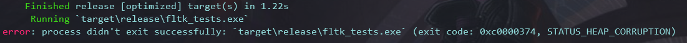

# fltk_heap_corruption

This has been fixed.
Just put `let mut my_app = MyApp::new();` before `let a = app::App::default();` from what i understood it's a drop impl in sysinfo calls win32's CoUninitialize() which messes with the window's destructor.

Basically moving `let mut my_app = MyApp::new();`  which calls `sysinfo::System::new_all()` to the beginning of main, i.e. before window creation should fix the issue. The sysinfo System window's component vec basically resizes and the drop calls [CoUninitialize](https://docs.microsoft.com/en-us/windows/win32/api/combaseapi/nf-combaseapi-couninitialize)

credits for the fix: mo_al_ in the rust programing language discord
